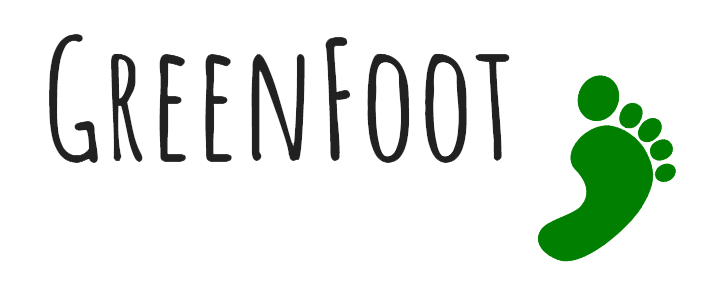

# About
Green Foot is an environmentally conscious app tasked with helping you both to reduce your carbon footprints and to increase your awareness of your own individual environmental impact. 
  
The web-based application was built in the context of a hackathon, held in Austin, Texas. The team consisted of [Divya Goruganthu](https://github.com/divyaxg), [Matthew Maxwell](https://mattmaxwell.tech), [Matthew Umana](https://mumana98.github.io/Website_Portfolio/index.html), [Danielle Cushing](https://github.com/dcushing), and [George Hou](https://gyhou.com/). We also received some help from [Marcel Bensch](https://github.com/mbensch).

# Instructions
The app can be found [here](https://diversity-hackathon.github.io/greenfoot-frontend/#/). It is incredibly easy to use. Just follow these steps to get started:
1. Enter a valid email address. We don't send anything - this was just for having a user ID associated with persistent carbon footprint data for that email address.
2. Enter a starting and target address and press the "Calculate CO2" button.
3. Observe the possible routes and their corresponding footprint.

# Acknowledgements
We cannot appreciate enough how supportive and helpful the team at Diversity Hackathon and Capital Factory was. The environment was wonderful to work in and we all are eager to come back to the next one. Thank you very much!